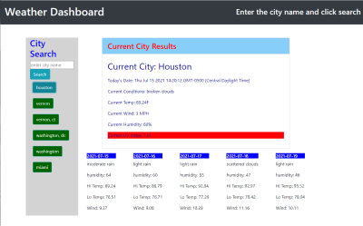

This is a weather dashboard that uses a 3rd-party API get the current conditions and the weather for any city you choose.  

You can enter the city and click the search button.  The page will display the current, up to the minute conditions for the city chosen.  

The UV Index will change color depending on the intensity of the sun at the current time.

Below it will show a summary of the 5day forecast. 

Below the search button a history of the searches in the current session will be displayed.  You can click one of them to repeat the search.

------------------------------------------------
App is deployed here: https://jpoulin587.github.io/weather-dashboard-06/

Technologies used: HTML5, CSS, BootStrap, JavaScript, jQuery, Moment, 3rd party API call

Screenshot image

-----------------------------------------------
Copyright (c) 2012-2021 James Poulin (https://github.com/jpoulin587)

Permission is hereby granted, free of charge, to any person obtaining
a copy of this software and associated documentation files (the
"Software"), to deal in the Software without restriction, including
without limitation the rights to use, copy, modify, merge, publish,
distribute, sublicense, and/or sell copies of the Software, and to
permit persons to whom the Software is furnished to do so, subject to
the following conditions:

The above copyright notice and this permission notice shall be
included in all copies or substantial portions of the Software.

THE SOFTWARE IS PROVIDED "AS IS", WITHOUT WARRANTY OF ANY KIND,
EXPRESS OR IMPLIED, INCLUDING BUT NOT LIMITED TO THE WARRANTIES OF
MERCHANTABILITY, FITNESS FOR A PARTICULAR PURPOSE AND
NONINFRINGEMENT. IN NO EVENT SHALL THE AUTHORS OR COPYRIGHT HOLDERS BE
LIABLE FOR ANY CLAIM, DAMAGES OR OTHER LIABILITY, WHETHER IN AN ACTION
OF CONTRACT, TORT OR OTHERWISE, ARISING FROM, OUT OF OR IN CONNECTION
WITH THE SOFTWARE OR THE USE OR OTHER DEALINGS IN THE SOFTWARE.

